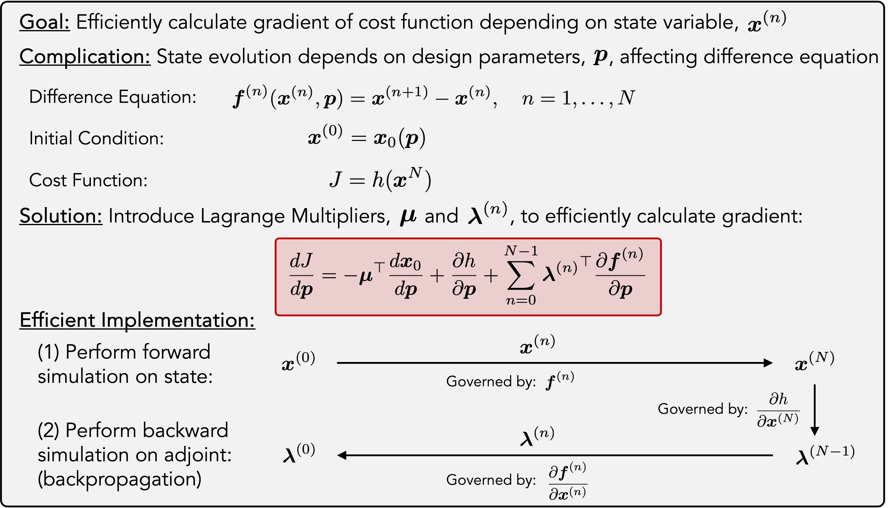

## TL;DR

This repo provides code for **rapid MRI excitation pulse optimization using a Chebyshev waveform basis** (instead of conventional piecewise-constant controls). Follow the steps below to get a working example running quickly.

```sh
# 1) Choose where you want the project folder (use $HOME, not "~" in quotes)
export ADJOINTMRIPATH="$HOME/path/to/intended/dir"

# 2) Create the directory and clone the repo into it
mkdir -p "$ADJOINTMRIPATH"
git clone https://github.com/john-drago/adjoint-MRI.git "$ADJOINTMRIPATH/adjoint-MRI"

# 3) Create a data directory alongside the repo
mkdir -p "$ADJOINTMRIPATH/data"
```

Copy the field map data from [this link](https://www.dropbox.com/scl/fo/hgihgdz7ddtvi9m738gat/AAja8SCBS_UjW5yP71Qf0MM?rlkey=nyfasth7379rqs1ecv2783okm&st=tcri4nte&dl=0) into `"$ADJOINTMRIPATH/data"`. 

 Run the following output (from the shell) to get the directory for MATLAB®:

```sh
echo "cd( '$ADJOINTMRIPATH/adjoint-MRI/scripts/2025-05-01-example-scripts/' )"
```

Launch MATLAB® and run the following commands:

```matlab
cd( 'path/from/above/adjoint-MRI/scripts/2025-05-01-example-scripts/' )
nonSelectiveUniversal_kTP;
```
You have just designed a non-selective excitation pulse using a Chebyshev waveform basis. Please see the sections below for more details about the underlying method and implementation. Thank you for visiting this repository!

## Introduction

This repository contains code from the submitted manuscript, "**The Ritz Adjoint Method for MRI Pulse Design**". The code provides the implementation for the [Ritz](https://eudml.org/doc/149295) adjoint method for excitation pulse design in MRI. The repository also includes scripts used to generate the data reported in the manuscript and example scripts that run with fieldmaps available through a Dropbox link.

Briefly, this code implements methods for rapid optimization of patient-specific MRI pulses. For high-field imaging, magnetic field ($B_1^+$ and $\Delta B_0$) inhomogeneities lead to flip angle variations that can be addressed in part through tailored MRI excitation pulse design. A challenge arises as more complex excitation pulses are designed: pulse durations lengthen and finer time discretization is required, making in-scanner optimization challenging, as the number of optimization variables increases. Moreover, pulse optimization has historically been performed using piecewise-constant bases, causing the number of optimization variables to increase as both pulse durations grow and time-step durations shrink.

We address the increasing optimization dimensionality by using parameterized waveform families as the optimization basis for excitation pulses. By using “global” basis functions (the [Ritz idea](https://epubs.siam.org/doi/10.1137/100804036) of minimizing an objective function over basis coefficients), we reduce the number of optimization variables used for pulse design. Since quasi-Newton methods require solving an inner linear system whose size scales with the number of variables, reducing the variable count can substantially decrease optimization time. In the accompanying manuscript, we demonstrate that by using a Chebyshev pulse optimization basis with an active-set solver implemented in MATLAB®, we can reduce optimization time relative to a state-of-the-art interior-point solver implemented in C++ for a broad array of pulse types, including non-selective excitation and inversion pulses and low- and high-flip angle slice-selective pulses.

To enable objective function derivative calculation for optimization, we use the adjoint method for difference equations, which pairs well with the rotation matrix "discrete-time" approximation for MRI forward model simulation. The adjoint method provides efficient objective function derivative calculation with respect to parameters that control multiple rotation matrices. The derivative calculation is implemented with MATLAB® `gpuArray`s, which accelerate vectorized operations by executing them on the GPU.

In this repository, we provide implementations beyond the piecewise-constant and Chebyshev bases, including Fourier series and piecewise-continuous polynomials (constructed using Chebyshev bases). For non-selective pulses, the framework also supports optimization with [kT-points](https://onlinelibrary.wiley.com/doi/10.1002/mrm.22978), [SPINS pulses](https://onlinelibrary.wiley.com/doi/full/10.1002/mrm.23118), and variable kT-point pulses, where the duration of individual blips can be optimized. We further illustrate the approach in multiphoton parallel transmission ([MP-pTx](https://onlinelibrary.wiley.com/doi/full/10.1002/mrm.30116)) designs with arbitrary large-flip angle targets.

The strength of the implemented adjoint method for MRI excitation pulse design lies in flexibility: the framework can optimize any parameterized pulse, whether defined locally or globally. The source code allows straightforward adaptability. For a new objective function, the only requirement is a function that defines the cost and an efficient procedure for computing the derivative. The same principle applies to waveform parameterizations. A parameterization must provide a procedure to generate waveforms from a chosen set of parameters, compute derivatives of the magnetic field waveforms with respect to those parameters (preferably using vectorized operations), and calculate the corresponding derivatives for any constraints associated with the parameterization.

## Directory Structure Details

This repository contains source code (in the `adjoint` folder) and scripts (in the `scripts` folder) to perform Ritz adjoint MRI excitation pulse optimization. An outline of the directory structure is below:

```text
adjoint-MRI/
├── adjoint/
│   ├── cheb/
│   │   ├── base/                            % base method
│   │   └── ...                              % other Chebyshev functions, constraints, derivatives
│   ├── fourier/
│   ├── pp/                                  % piecewise-continuous polynomial
│   ├── pwc/                                 % piecewise-constant basis
│   ├── run/                                 % core adjoint functions
│   └── ...                                  % additional contents
├── scripts/
│   ├── ...                                  % other script folders
│   ├── 2025-04-01-universal-nonselective/
│   ├── 2025-04-02-tailored-nonselective/
│   ├── 2025-04-03-universal-selective/
│   ├── 2025-04-04-tailored-selective/
│   └── 2025-05-01-example-scripts/
├── sim/
└── util/

data/
├── fields/
│   ├── 2025-01-01-simulated-fields/                             % simulated fields and VOPs
│   ├── 2025-01-02-Siemens-Nova-8ch-pTx-Database-scaled/         % empty
│   ├── 2025-01-02-Siemens-Nova-8ch-pTx-SAR/                     % empty
│   ├── 2025-01-03-sim-32ch-shim-coil/
├── opt/                                                         % optimization outputs
```

We recommend cloning the repository into a directory that also contains a `data` folder at the same level as the `adjoint-MRI` directory. The scripts assume this relative layout and expect a `data` directory in that location.

Example scripts are in the `adjoint-MRI/scripts/2025-05-01-example-scripts/` directory. These scripts rely on fieldmaps in the `data/fields/2025-01-01-simulated-fields/` directory (see below). Lightly adapted versions of the scripts used to generate the manuscript data are located in the `adjoint-MRI/scripts/2025-04-***/` directories. Each file includes the relevant `active-set` and `IPOPT` settings for its optimization. Please see below for additional details on experimental implementation.

The source code for the adjoint method is in the `adjoint-MRI/adjoint/` directory. The core implementation is located in the `run` folder, which provides the main functions implemented with optimized MATLAB® `gpuArray` code. Versions of the code are available for both CPU-based and GPU-accelerated optimization. 

## Data Availability

The source $B_1^+$ and $\Delta B_0$ maps, as well as the VOP data for the Nova 8-Tx, 32-Rx coil used in this project, **cannot be made publicly available**, because the data is proprietary to Siemens Healthineers. These datasets may, however, be obtained from your local Siemens Healthineers contact if your institution has access to a Siemens Terra.X scanner and corresponding research agreement. All data were shared under a research agreement between the A. A. Martinos Center and Siemens Healthineers.

To lower the barrier to using this code, we provide simulated fieldmaps (and VOPs) that can be used together with the example scripts located in the `adjoint-MRI/scripts/2025-05-01-example-scripts/` directory. The simulated fieldmaps can be downloaded [here](https://www.dropbox.com/scl/fo/hgihgdz7ddtvi9m738gat/AAja8SCBS_UjW5yP71Qf0MM?rlkey=nyfasth7379rqs1ecv2783okm&st=4lpuh80u&dl=0). 

Please place these files in the `data` folder located at the same level as the `adjoint-MRI` directory (or wherever the repository is cloned). The example scripts assume this directory structure.


## Code Structure

The source code is designed with modularity to support waveform optimization across many different basis types. 

#### Pulse Specification

The `pulse` structure defines the type of pulse to be optimized. For each optimization, two core fields must be specified:  

- `pulse.name` identifies the basis (for example, `cheb` for Chebyshev polynomials).  
- `pulse.type` modifies the basis specification (for example, `base` for the baseline implementation used in the experiments presented here).  

Additional fields describe the excitation type (for example, `non-selective` or `slice-selective`) and the cost functions. The cost functions are set using `pulse.terminalCostFunction` and `pulse.runningCostFunction`. In the demonstrations presented here, `pulse.runningCostFunction` is left empty, because only the final magnetization is penalized. The field `pulse.optPopulation` should also be specified to indicate whether the problem is framed as a `universal` or `tailored` design.

#### Data Structures During Optimization

Three structures are passed throughout the optimization:  

- `wv` (waveform): In the adjoint implementation, the `wv` structure serves as the primary container for the waveform being optimized, along with necessary vectorized fields.
- `opt` (optimization data): Contains timing information, constraint information, and function handles used during optimization.  
- `oc` (optimization control): Specifies which optimizer is used, manages optimizer settings, and records metadata about the optimization process.  

#### Example: Chebyshev Non-Selective Optimization

As an example, consider optimization of a non-selective excitation in the Chebyshev basis using the arccosine least squares cost function with a local SAR constraint.  

- Initialization  
When the `opt` structure is initialized, all fields from the `fields` structure are stored in matrices for vectorized operations.  

- Pulse Specification  
The function `processChebPulse_base` is then called. This function determines the number of optimization variables, arranges them for easy access, and assigns preliminary constraints to ensure safety. User-specified constraints are added next, along with their evaluation functions. Matrices for linear equality and inequality constraints are also generated at this stage.  

- Cost Functions  
The function `processAdjointFunctions` assigns function handles for the terminal and running cost functions. In this example, the terminal cost function is `runArccosLeastSquaresCost`, accessed through the `opt.terminalCostFunction` handle.  

- Preparation  
The `prepareAdjointOpt` function configures the optimization based on the specifications in the `oc` structure.  

- Running the Optimization  
The optimization is executed through `runAdjointOpt`. At this point, the key function handles have already been specified, enabling the optimizer to run. For each iteration, waveforms are generated with `generateChebWaveform_base`, which is called by the `opt.generateWaveforms` handle.  

#### Adjoint Derivative Calculation  
The adjoint method is employed to calculate analytical derivatives for the optimizer. A brief overview of the implementation is given here, while the manuscript provides the full mathematical details.  

1. **Forward Simulation:**  

The forward dynamic simulation is performed across the pulse duration, with magnetization states saved in the `Marray` array for later use during adjoint derivative calculation (some alternative approaches store only a subset of states and recompute intermediates on the fly, but the standard adjoint method saves all states directly). This forward simulation is implemented in the `runAdjointCostFunction` code.  

2. **Backward Propagation:**  

If derivatives are required, the adjoint method is applied, which is essentially equivalent to backpropagation. The derivative of the terminal cost function with respect the final state and/or the design parameters, which are returned as separate outputs.  

The resulting derivative of the cost function with respect to the final state becomes the terminal Lagrange multiplier, which is then propagated backward through the pulse. Due to properties of rotation matrices, this propagation follows the transpose (or inverse) of the rotation matrix with additional contributions if a running cost function is present.  

For efficiency, the contribution of the Lagrange multipliers to the overall derivative is calculated concurrently with the backward pass. This involves determining how the optimization parameters modify the difference function. The implementation employs the function handle `opt.forwardModelGradientFunction`, which invokes `forwardModelGradientCheb_base` to vectorize the computation of parameter effects on the rotation matrix at each time step.

See the diagram below for a schematic overview.  



#### Constraint Handling

Constraints and their derivatives are computed alongside the cost function. All nonlinear constraints are evaluated by the `opt.nonlcon` handle, which calls `nonlconCombine` to ensure constraint values and derivatives are assembled correctly. Vectorized operations are used throughout for efficiency. The linear equality and inequality constraints are assigned to the `opt.A`/`opt.b` and `opt.Aeq`/`opt.beq`, respectively.

#### Use with optimizers
With the ability to evaluate the cost function, compute the objective function derivative with respect to the optimization parameters, handle constraints, and calculate constraint derivatives, the framework can employ standard off-the-shelf solvers to perform excitation pulse optimization using quasi-Newton methods.


## Example Code Usage  

After the data are downloaded to the correct directory, any of the example scripts in `/adjoint-MRI/scripts/2025-05-01-example-scripts/` can be run:  

- `nonSelectiveUniversal_kTP.m`  
- `nonSelectiveUniversal_SPINS.m`  
- `selectiveUniversal_spokes.m`  

Each script produces an excitation pulse optimized in a Chebyshev basis. The code attempts to use a compatible GPU for adjoint derivative calculations. If no GPU is available, the scripts automatically fall back to a CPU implementation.  

## Experimental Implementation  

Optimization experiments were performed on the [MIT SuperCloud](https://supercloud.mit.edu) using Intel Xeon Gold 6248 processors (40 cores), 384 GB of RAM, and NVIDIA Volta V100 GPUs with 32 GB of memory.

All Ritz adjoint source code was written in MATLAB®. Experiments were run using MATLAB® version 2023b. For comparison with state-of-the-art optimizers, we used `IPOPT`, which was built from source and accessed in MATLAB® through `mexIPOPT`. Step-by-step implementation details for a Linux operating system are provided at the bottom of this page.  

## Acknowledgements  

Some of the functions in this repository used for projection and root finding of Chebyshev polynomials are heavily inspired by (and in some cases include lines of code from) the [`chebfun`](https://github.com/chebfun/chebfun) MATLAB® directory. We also thank an anonymous GitHub user for assistance with compiling `IPOPT` and `mexIPOPT` and for helping ensure the code runs properly.  

## IPOPT and mexIPOPT implementation (Linux)

On a Linux workstation, run the following code (requires `git`):

```sh
export WORKPATH="$HOME/matlab"
mkdir -p "$WORKPATH"

git clone https://github.com/ebertolazzi/mexIPOPT.git "$WORKPATH/mexIPOPT"
cd "$WORKPATH/mexIPOPT"
git checkout 820aa5bb36

git clone https://github.com/coin-or/Ipopt.git "$WORKPATH/Ipopt"
cd "$WORKPATH/Ipopt"
git checkout f7d4d416ae
mkdir build && cd build

../configure --prefix="$WORKPATH/Ipopt/compiled" --enable-static --disable-shared --with-mumps-cflags="-I$WORKPATH/mexIPOPT/Ipopt/include_linux/coin-or/mumps"
make && make install
```

Next, we need to edit one of the `mexIPOPT` source files to ensure it can read C compilers greater than 10:

```sh
vim lib/ipopt.m

# inside vim:
# -----------------------------------------------------------
#   :271
#   myCCompiler = mex.getCompilerConfigurations('C', 'Selected');
#   myCCompilerVersionSplit = split( myCCompiler.Version, '.' );
#   switch myCCompilerVersionSplit{ 1 }
#   :wq
# -----------------------------------------------------------
```

Now that the file is changed, we can compile `mexIPOPT`:

```sh
# Try without this line first; add only if needed:
# export LD_PRELOAD=/usr/lib/x86_64-linux-gnu/libstdc++.so.6

/path/to/matlabr2023b/bin/mex -v  -R2018a -DMATLAB_DEFAULT_RELEASE=R2018a \
	-I$WORKPATH/mexIPOPT/toolbox/src \
	$WORKPATH/mexIPOPT/toolbox/src/ipopt.cc \
	$WORKPATH/mexIPOPT/toolbox/src/IpoptInterfaceCommon.cc \
	-I$WORKPATH/Ipopt/compiled/include/coin-or \
	-I$WORKPATH/mexIPOPT/Ipopt/include_linux/coin-or \
	-DOS_LINUX -output $WORKPATH/Ipopt/compiled/bin/linux_5/ipopt_linux_5 \
	CXXFLAGS='$CXXFLAGS -Wall -O2 -g' \
	LDFLAGS='$LDFLAGS -static-libgcc -static-libstdc++ -Wl,-rpath,$MATLABROOT/bin/$ARCH -Wl,-rpath,.' \
	-L$WORKPATH/Ipopt/compiled/lib \
	-L$WORKPATH/mexIPOPT/toolbox/bin/linux_5 \
	-L$MATLABROOT/bin/$ARCH \
	-lipopt -lcoinmumps -lopenblas -lgfortran -lgomp -ldl -lMatlabDataArray -lmx -lmex -lmat -lm 
```

Run the following shell commands to get commands to run in MATLAB®.
```sh
# Statements to run inside matlab
echo "cd( '$WORKPATH/mexIPOPT/toolbox/examples' )"
echo "addpath( '$WORKPATH/mexIPOPT/toolbox/lib' )"
echo "addpath( '$WORKPATH/Ipopt/compiled/bin/linux_5' )"

```
Next, launch MATLAB® and change the directory and add paths as above.

## IPOPT and mexIPOPT implementation (Mac ARM / Apple Silicon)

mexIPOPT can also be compiled with IPOPT on Mac ARM (Apple Silicon), following [this discussion](https://github.com/ebertolazzi/mexIPOPT/issues/24), ([archived link](https://web.archive.org/web/20250909145515/https://github.com/ebertolazzi/mexIPOPT/issues/24)).

In Terminal (requires Homebrew), run the following shell comands:

```sh
export WORKPATH="$HOME/MATLAB"
mkdir -p "$WORKPATH"

git clone https://github.com/ebertolazzi/mexIPOPT.git "$WORKPATH/mexIPOPT"
cd "$WORKPATH/mexIPOPT"
git checkout 820aa5bb36

brew install ipopt
```

Place the provided `homebrew_ipopt.patch` file (included in this repo under the `assets` diretory) into `$WORKPATH/mexIPOPT/toolbox`. Then run shell commands:

```sh
cd "$WORKPATH/mexIPOPT/toolbox"
patch -u -b CompileIpoptMexLib.m -i homebrew_ipopt.patch
```
We can get the full path to the toolbox by running the following.

```sh
echo "cd( '$WORKPATH/mexIPOPT/toolbox' )"
```

Start MATLAB® and run the following:

```matlab
cd( '/output/from/above' )
CompileIpoptMexLib
```

Next, edit `$WORKPATH/mexIPOPT/toolbox/lib/ipopt.m`. Update line 264 under the `ismac` branch to allow `MACA64`:

```matlab
...
function [x,info] = ipopt(varargin) % line 249
	...
  if ispc % line 252
  	...
  elseif ismac % line 261
    if isOctave % line 262
    	[x,info] = ipopt_osx_octave(varargin{:}); % line 263
    elseif ( strcmp( cmp, 'MACI64') == 1 ) || ( strcmp( cmp, 'MACA64') == 1 ) || ( regexp( cmp, 'x86_64-apple-darwin') == 1 ) % CHANGE THIS LINE, line 264
        [x,info] = ipopt_osx(varargin{:}); % line 265
     ...
    end % line 268
    ...
  end % line 287
end % line 288
```

Test by adding the library paths and running the examples:

Get the commands to run in MATLAB® from running the shell commands:

```sh
echo "addpath( '$WORKPATH/mexIPOPT/toolbox/lib' )"
echo "addpath( '$WORKPATH/mexIPOPT/toolbox/bin/osx' )"
echo "cd( '$WORKPATH/mexIPOPT/toolbox/examples' )"
```

Then, in MATLAB®:

```matlab
addpath( '/first/output/from/above' )
addpath( '/second/output/from/above' )
cd( '/third/output/from/above' )
test_ipopt
```
To match the directory structure expected by this repository, move the `ipopt_osx.mexmaca64` file to the expected location with the following:

```sh
mkdir -p "$WORKPATH/Ipopt/compiled/bin"
src="$WORKPATH/mexIPOPT/toolbox/bin/osx/ipopt_osx.mexmaca64"
dst="$WORKPATH/Ipopt/compiled/bin/ipopt_osx.mexmaca64"
cp -u "$src" "$dst"
```

